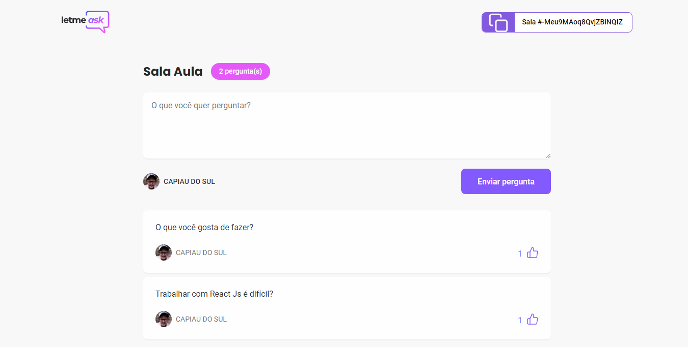
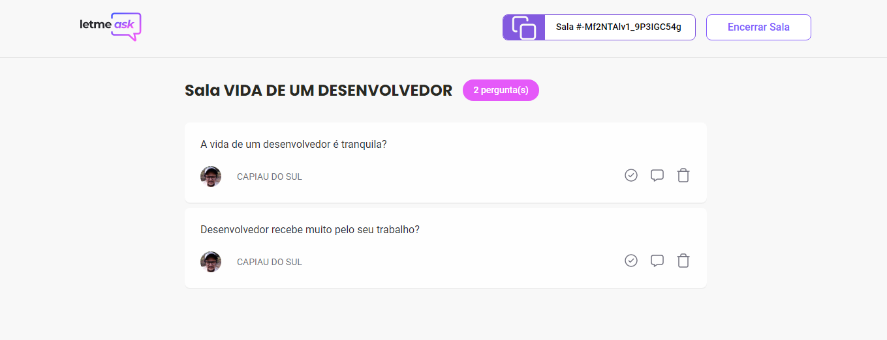

# LetMeask

O o intudo do projeto foi criar uma sala de perguntas.
Usando a autenticação da sua conta no Google.

O usário pode criar uma nova sala, ou logar em uma sala já existente.

Podem fazer perguntas e da like nas outras perguntas existentes. 

O administrador da sala, pode marcar a pergunta como respondida ou remove-la caso seja uma pergunta que não tenha relação com o nome da sala.

## Business Rules
    [ x ] Only authenticated users read data fro rooms and questions;
    [ x ] Only authenticated users can create new rooms
    [ x ] Only authenticated users can send new questions;
    [ x ] Only authenticated users can like a questions;
    [ x ] User can remove a question like if he is the owner;
    [ x ] User can't update or delete questions highlight and answered data;
    [ x ] Only the room owner can close the room;
    [ x ] Don't allow duplicated likes from sama author;
    [ x ] Don't allow user to like own questions;

# DEPENDÊNCIAS
    "classnames": "^2.3.1",
    "firebase": "^8.7.1",
    "node-sass": "^5.0.0",
    "react": "^17.0.2",
    "react-dom": "^17.0.2",
    "react-router-dom": "^5.2.0",
    "react-scripts": "4.0.3",
    "typescript": "^4.1.2",
    "web-vitals": "^1.0.1"

# Dependências de Desenvolvimento
    "@types/react-router-dom": "^5.1.8"  

# 📱 ScreenShot
### Tela de login ou ingressar em uma sala existente

  

### Tela para criar uma sala

  

#### Sala criada com perguntas e a pergunta com o like.

  

#### Tela onde o Adminstrador consegui excluir, marcar como respondida e da check para que pergunta não seja mais respondida.

  

<h1 align="center">💻 Desenvolvido Por: Gilberto Júnior</h1>