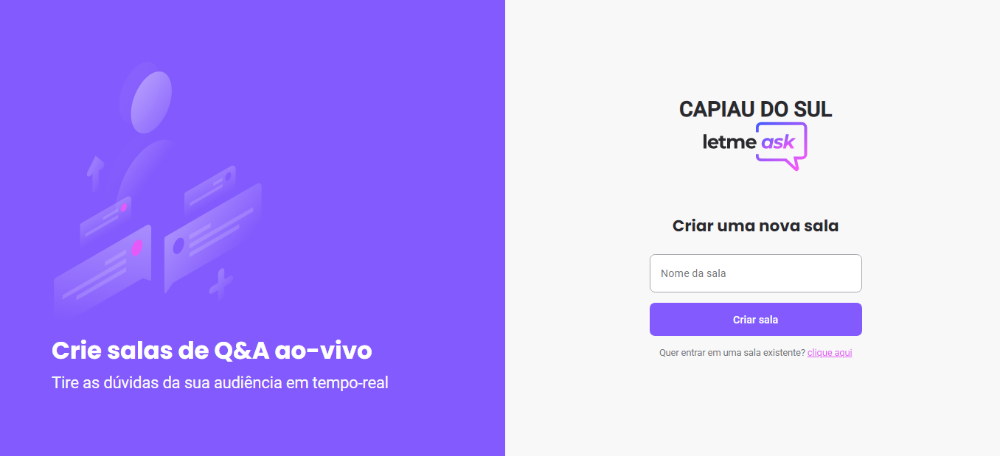

# LetMeask

## Regras de negócios
    [ x ] Only authenticated users read data fro rooms and questions;
    [ x ] Only authenticated users can create new rooms
    [ x ] Only authenticated users can send new questions;
    [ x ] Only authenticated users can like a questions;
    [ x ] User can remove a question like if he is the owner;
    [ x ] User can't update or delete questions highlight and answered data;
    [ x ] Only the room owner can close the room;
    [  ] Don't allow duplicated likes from sama author;
    [  ] Don't allow user to like own questions;

  
  

